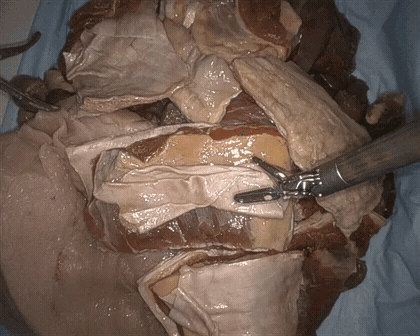

<div align="center">

# Verifier-Guided Multi-Teacher Distillation<br/>for Streaming Tissue Tracking

**STIR Challenge 2026 — Team `NCT_TSO`**

Danush Kumar Venkatesh · Peng Liu · Stefanie Speidel<br/>
*National Center for Tumor Diseases (NCT) Dresden*

[](stirc2026_nct_tso.pdf)
[](LICENSE)
[](NOTICE.md)
[](requirements.txt)

</div>

---

Point trackers trained on synthetic data drift on real laparoscopic video, and
surgical datasets almost never carry the dense per-frame annotation you would
need to fine-tune them. STIR is annotated only at the **first and last frame** of
each clip, via infrared tattoos.

This repository turns that single endpoint into enough supervision to fine-tune a
tracker, with no hand annotation:

1. **Six point trackers** run offline over every clip and store their trajectories.
2. A **verifier** scores each teacher at each frame from three trust signals —
   the known endpoint (supervised), forward/backward cycle consistency, and
   cross-teacher agreement (both self-supervised).
3. Scored candidates are **fused** into one trajectory per point with a per-frame
   confidence weight.
4. A single **LiteTracker** student is fine-tuned on those weighted labels.

One checkpoint serves all three challenge tracks; only the inference entry point
differs. No new architecture is introduced — LiteTracker is the causal, streaming
formulation of CoTracker3-Online, so a fine-tuned CoTracker3-Online checkpoint
loads into it unchanged.

<div align="center">
<table>
<tr>
<td align="center"><b>All the supervision that exists</b><br/><sub>IR tattoos, a median of 6 per clip, annotated only at the first and last frame</sub></td>
<td align="center"><b>What the student does with it</b><br/><sub>tracking a 64&nbsp;px grid — 320 points — under the streaming runtime</sub></td>
</tr>
<tr>
<td></td>
<td></td>
</tr>
</table>
</div>

> The GIFs are not in the repository yet — build them with
> `bash tools/make_gifs.sh` (needs ffmpeg, the venv and the dataset). See
> [assets/README.md](assets/README.md).

## Results

32 held-out clips (234 points) from the STIR 2025 test collection, streaming
runtime, every frame processed — the same forward pass as the submitted
container.

| track | refinement iters | metric | score |
|---|---|---|---|
| 2D accuracy | 4 | δ_avg over 4/8/16/32/64 px | **0.8103** |
| 2D latency | 1 | δ_avg / p95 latency (RTX A5000) | **0.8085** / **48.7 ms** |
| 3D | 4 | accuracy over 2/4/8/16/32 mm | **0.7031** |
| *static-point baseline* | — | 3D accuracy | *0.6115* |

Full board, paired clip-level bootstraps and the noise analysis:
[docs/results/ranking.md](docs/results/ranking.md). Method and ablations:
**[the report PDF](stirc2026_nct_tso.pdf)**.

Every difference at the top of the 2D board is a statistical tie. The evaluation
has an intra-clip correlation of 0.40 and a design effect of 3.54, so an
*unpaired* comparison needs ~21 pp to mean anything — read the paired deltas, not
the individual confidence intervals.

## Install

Python 3.12, CUDA 12.1, one GPU. Training used a single A100 80 GB (~17 h).

```bash
git clone https://github.com/danushkv/STIR2026_challenge && cd STIR2026_challenge
uv venv --python 3.12 .venv && source .venv/bin/activate
uv pip install -r requirements.txt --extra-index-url https://download.pytorch.org/whl/cu121
```

`requirements.txt` is the exact freeze of the released training run, cross-checked
against the environment Weights & Biases recorded for it.

### STIRLoader — needs a patch

```bash
git clone https://github.com/athaddius/STIRLoader && cd STIRLoader
git checkout 7e7f87c
git apply ../patches/stirloader-streaming-skip.patch
uv pip install --no-deps -e . && cd ..
```

Stock upstream decodes a whole clip before applying the frame stride; the patch
moves the stride into the ffmpeg read loop. It keeps **exactly** the same frames
(verified exhaustively for clip lengths 1–600 against every `SKIP` we use), so
it is a memory fix, not a correctness one — but on the longest evaluation clip
it is the difference between 16.3 GB and 3.3 GB for the stereo pair. Every
result here was produced with it. Skip it only if you have the RAM.

`--no-deps` is required: STIRLoader pins `numpy==1.23.5` and
`opencv-contrib-python==4.5.5.64`, which would downgrade numpy a major version
and add a conflicting OpenCV.

### Upstream repositories

Clone these as **siblings of this repository**, or point the environment
variables at them. Nothing is vendored here.

```bash
git clone https://github.com/facebookresearch/co-tracker          # training
git clone https://github.com/gorkaydemir/track_on                 # 5 of 6 teachers
git clone https://github.com/serycjon/MFT                         # 6th teacher
git clone https://github.com/mertkaraoglu/stir-challenge-2026-inference   # container
git clone https://github.com/mertkaraoglu/stir-challenge-2026-metrics     # official metrics
# LiteTracker (arXiv:2504.09904) -- the streaming runtime; place at ./lite-tracker-master
```

| variable | default | needed for |
|---|---|---|
| `THIRDPARTY_ROOT` | parent of this repo | all of the below at once |
| `STIRLOADER_ROOT` | `$THIRDPARTY_ROOT/STIRLoader` | any clip decode |
| `LITETRACKER_ROOT` | `$THIRDPARTY_ROOT/lite-tracker-master` | any streaming evaluation |
| `STIR_INFERENCE_ROOT` | `$THIRDPARTY_ROOT/stir-challenge-2026-inference` | 3D eval with the pixel matcher |
| `STIR_METRICS_ROOT` | `$THIRDPARTY_ROOT/stir-challenge-2026-metrics` | AJ / ATA / OA |
| `DATA_ROOT` | `/mnt/cluster/datasets` | dataset and artifact locations |

Only MFT needs a separate environment — it pins incompatible torch/timm versions.
Since label generation is offline, teachers never run together: each writes its
`.npz` output into a shared directory on its own schedule.
[docs/ENVIRONMENTS.md](docs/ENVIRONMENTS.md) has the details.

## Data

| dataset | get it from |
|---|---|
| STIROrig | [IEEE DataPort, doi:10.21227/w8g4-g548](https://dx.doi.org/10.21227/w8g4-g548) |
| STIR Challenge 2024 | [Zenodo record 14803158](https://zenodo.org/records/14803158) |

Expected layout — the format STIRLoader reads and every script assumes:

```
<STIR_ROOT>/<patient>/calib.json                     # stereo calibration, for the 3D track
<STIR_ROOT>/<patient>/<left|right>/seq<NN>/
    frames/<start>ms-<end>ms-visible.mp4             # the video
    segmentation/icgstartseg.png                     # IR tattoo mask, first frame
    segmentation/icgendseg.png                       # IR tattoo mask, last frame
```

A clip is identified everywhere by `<patient>__<side>__<seq>`, e.g.
`0__left__seq00`. That id is what ties a raw teacher track to a pseudo-label to a
set of frames, so it must stay stable.

Training used **both** collections through a symlink farm, because 2024's patient
`02` and STIR's patient `2` would otherwise collide:

```bash
bash scripts/make_stir_combined.sh   # STIRDataset + STIRChallenge_2024 -> STIRcombined
```

Full detail, including every intermediate artifact directory:
[docs/DATA.md](docs/DATA.md).

## Checkpoints

| checkpoint | needed for | where |
|---|---|---|
| **`student.pth`** (ours) | inference, evaluation | ⚠️ *release URL to be added — see below* |
| `scaled_online.pth` | training from stock CoTracker3 | [HuggingFace `facebook/cotracker3`](https://huggingface.co/facebook/cotracker3/resolve/main/scaled_online.pth) |
| `litetracker_finetuned.pth` | reproducing our exact run (it is the initialisation) | STIR 2025 winning entry |
| `alltracker.pth`, `locotrack_base.ckpt`, `track_on_r.pt`, `trackon2_dinov3_checkpoint.pt` | **label generation only** | the respective upstream releases; place in `track_on/checkpoint/` |

Only `student.pth` is needed to run or evaluate the model. The teacher
checkpoints are needed only if you regenerate pseudo-labels from scratch.

Put ours at `submission/weights/student.pth` — see
[submission/weights/README.md](submission/weights/README.md).

> **Licence:** the weights are **CC BY-NC 4.0**, not MIT. They descend from
> CoTracker3 / LiteTracker, which are non-commercial. The MIT licence covers the
> code only. [NOTICE.md](NOTICE.md) explains this and lists every dependency's
> terms.

## Run the pipeline

Steps 1–2 are GPU-days and only needed if you regenerate the labels. To train on
the released pseudo-labels, or just to evaluate, start at step 3 or 4.

### 1. Collect teacher trajectories

```bash
for t in cotracker3 alltracker locotrack trackon2 trackon_r mft; do
  bash scripts/collect_teacher.sh "$t" orig     # and: "$t" 2024
done
```

Writes `<raw_tracks_root>/<teacher>/<patient>/<side>__<seq>__<teacher>.npz`.
`--skip 5` is pinned inside the script and must match `skip: 5` in
`src/train.yaml` — the trainer indexes frames by that stride.

Coverage report before moving on (teachers legitimately differ: some skip clips
with no IR segmentation, so unequal coverage is expected, not an error —
`run_phase2.py` groups clips by which teachers covered them):

```bash
python src/sanity_check.py <raw_tracks_root>
```

### 2. Verify and fuse into pseudo-labels

```bash
bash scripts/run_phase2.sh
```

CPU only, numpy only — imports no tracker. Produces **626 files / 6 548 points**;
547 clips fused from all six teachers, 79 copied through from a single covering
teacher. `--mode aggregate` (confidence-weighted blend) is what the released
model used; `select` (highest-scoring teacher per frame) is the alternative.

### 3. Train

```bash
bash scripts/train.sh          # ~17 h on one A100 80GB
```

Defaults to a fresh run directory and refuses to start if one already holds
checkpoints — the trainer overwrites `student_e<N>.pth` unconditionally. Add
`wandb.enabled=false` to skip Weights & Biases.

| | |
|---|---|
| initialisation | `litetracker_finetuned.pth` (the 2025 winning checkpoint) |
| objective | CoTracker3's own `sequence_loss`: `0.05·coord + vis + conf` |
| supervision | `weighted` — the verifier's per-frame weight multiplies the coordinate loss's validity mask |
| lr / epochs / batch | 2e-5 / 45 / **1 clip per step** |
| window_len / train_iters | 16 / 4 |
| resolution / frames / points | 384×512 / ≤64 per clip / ≤384 per clip |

Every hyperparameter lives in [`src/train.yaml`](src/train.yaml)
and is overridable on the command line in either `--key value` or `key=value`
form.

### 4. Evaluate

```bash
python src/eval_sweep.py --config src/train.yaml \
    tag=my_run student_checkpoint=<path>/student_e44.pth \
    val_stir_root=<path>/STIRTest_2025 iters_list='[1,2,4]' \
    out_dir=<out> < /dev/null

python src/compare_ckpts.py <out> --n-boot 10000 --out-dir <out>/analysis
```

`eval_sweep.py` streams every frame through LiteTracker — 2D endpoint, 3D
endpoint, cycle drift and visibility in one pass. `compare_ckpts.py` merges the
shards and ranks them with a paired clip-level bootstrap that *measures* the
intra-clip correlation instead of assuming independence.

The `< /dev/null` is not cosmetic: STIRLoader decodes with ffmpeg, ffmpeg reads
stdin, and inside a `while read` loop it will eat the loop's input.

To compare a reproduction against the released checkpoint on identical clips and
points, `bash scripts/eval.sh` does both steps and the pairing.

### 5. Build the submission container

```bash
cd submission && bash build_all.sh && bash test_submission.sh
```

One image, three tracks; they differ only in entry script and wrapper class. See
[submission/README.md](submission/README.md).

## Repository layout

```
src/
  # pseudo-label generation
  teachers.py              the six teacher adapters, each importing its own deps lazily
  collect_tracks.py        phase 1 CLI: run one teacher over one collection
  collect_extra_points.py  densification: extra query points, tracked by one teacher
  verifier.py              THE CORE. endpoint + cycle + agreement -> per-frame trust
  pseudo_label.py          per-clip fusion: select or aggregate
  run_phase2.py            phase 2 CLI
  evaluate_labels.py       score each teacher and the fusion against endpoint GT
  trajectories.py          TrackResult / PseudoLabel containers and their npz format
  config.py                pipeline config dataclasses

  # training
  model.py                 build the student, config system, per-clip subsampling
  train.py                 the trainer
  train.yaml               every hyperparameter

  # evaluation, all under the streaming runtime the challenge scores
  student_lt_wrapper.py    load a checkpoint into LiteTracker (no conversion needed)
  eval_common.py           metric definitions shared by the three evaluators
  eval_2d.py               2D endpoint accuracy
  eval_3d.py               3D accuracy, in millimetres, by triangulation
  eval_sweep.py            2D + 3D + cycle drift + visibility, one pass, one checkpoint
  compare_ckpts.py         paired clip-level bootstrap over eval_sweep shards
  latency_from_preds.py    p95 frame latency from a container's preds.json

  # utilities
  _thirdparty.py           locate the cloned upstream repos
  sanity_check.py          did every teacher cover the same clips?
  visualize_pseudo_labels.py

scripts/      one shell driver per stage; see scripts/README.md
tools/        render the student to video, build the README GIFs
submission/   the three challenge tracks: two wrappers, one Dockerfile
patches/      the STIRLoader patch, with its base commit
docs/         reproduction guide, run ledger, measured results, caveats
```

| doc | what |
|---|---|
| [docs/REPRODUCE.md](docs/REPRODUCE.md) | end-to-end reproduction, with expected numbers at each step |
| [docs/RUNS.md](docs/RUNS.md) | every checkpoint we trained and the exact command behind it |
| [docs/DATA.md](docs/DATA.md) | dataset roots, clip ids, every artifact directory |
| [docs/ENVIRONMENTS.md](docs/ENVIRONMENTS.md) | the two venvs, the clones, the teacher checkpoints |
| [docs/CAVEATS.md](docs/CAVEATS.md) | **where the code and the report disagree — read before quoting a number** |
| [docs/CHANGES.md](docs/CHANGES.md) | how this repository was assembled from the working tree |

Before opening a PR — or after any rename, move or delete:

```bash
python tools/check_repo.py
```

It verifies that every cross-module import resolves, that nothing references a
module which no longer exists, that every git-tracked file is on disk, that
every relative Markdown link points somewhere real, and that all shell and
Python parses. It exists because a rename pass over `src/` once left stale
references in `tools/`, `scripts/` and the docs.
| [docs/results/](docs/results/) | the full ranking tables, original and reproduction |

`src/` is flat on purpose: the modules import each other by bare name, exactly
as they did when the results were produced. [docs/CHANGES.md](docs/CHANGES.md)
records every difference between this repository and that working tree — what
was renamed, what was deleted, and how it was verified.

## Citing

If this code or checkpoint is useful, please cite the repository and the STIR
dataset — or just ⭐ the repo, that helps too.

```bibtex
@software{venkatesh2026stir,
  author  = {Venkatesh, Danush Kumar and Liu, Peng and Speidel, Stefanie},
  title   = {Verifier-Guided Multi-Teacher Distillation for Streaming Tissue Tracking},
  year    = {2026},
  url     = {https://github.com/danushkv/STIR2026_challenge},
  note    = {STIR Challenge 2026, Team NCT\_TSO}
}

@article{schmidt2024stir,
  author  = {Schmidt, Adam and Mohareri, Omid and DiMaio, Simon P. and Salcudean, Septimiu E.},
  title   = {Surgical Tattoos in Infrared: A Dataset for Quantifying Tissue
             Tracking and Mapping},
  journal = {IEEE Transactions on Medical Imaging},
  volume  = {43},
  number  = {7},
  pages   = {2634--2645},
  year    = {2024},
  doi     = {10.1109/TMI.2024.3372828}
}
```

Machine-readable: [CITATION.cff](CITATION.cff). The report's full reference list —
LiteTracker, CoTracker3, AllTracker, LocoTrack, MFT, Track-On2, Track-On-R — is
in [the PDF](stirc2026_nct_tso.pdf).

## Licence

Code: [MIT](LICENSE). Weights: **CC BY-NC 4.0** (inherited from CoTracker3 /
LiteTracker). Dataset: its own terms. Details and every dependency's licence:
[NOTICE.md](NOTICE.md).

## Acknowledgements

Built on [CoTracker3](https://github.com/facebookresearch/co-tracker),
LiteTracker, [track_on](https://github.com/gorkaydemir/track_on),
[MFT](https://github.com/serycjon/MFT) and
[STIRLoader](https://github.com/athaddius/STIRLoader). Thanks to the STIR
challenge organisers for the dataset and the evaluation harness.
