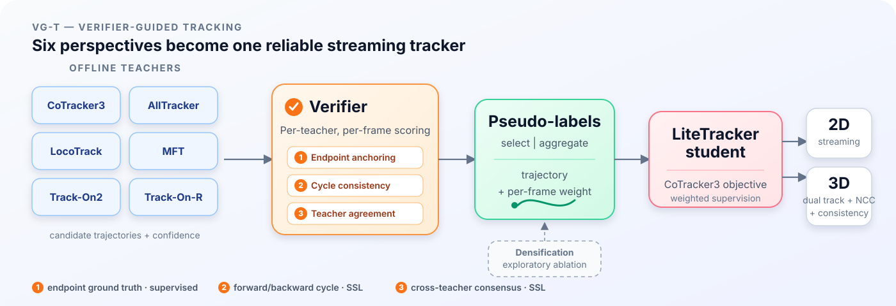
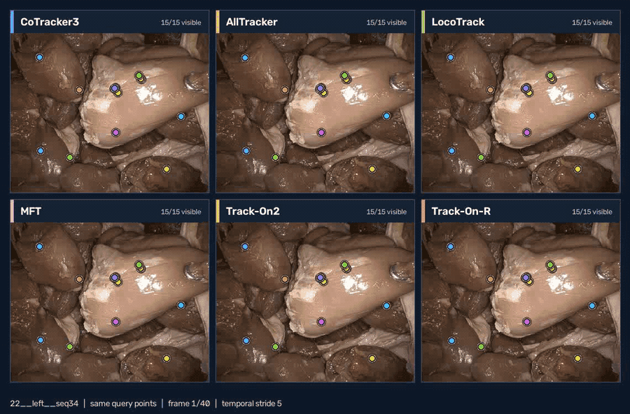

<div align="center">

# VG-T: Verifier-Guided Tracking

### Multi-Teacher Distillation for Streaming Tissue Tracking

**STIR Challenge 2026 — Team `NCT_TSO`**

Danush Kumar Venkatesh · Peng Liu · Stefanie Speidel<br/>
*National Center for Tumor Diseases (NCT) Dresden*

[](stirc2026_nct_tso.pdf)
[](LICENSE)
[](NOTICE.md)
[](requirements.txt)

</div>

VG-T converts sparse endpoint annotations into dense supervision for streaming
tissue tracking. Six point trackers propose trajectories; a verifier scores
them using endpoint anchoring, forward/backward cycle consistency, and
cross-teacher agreement. The scored candidates are fused into weighted
pseudo-labels and used to fine-tune one LiteTracker student.

The repository is developed from
[CoTracker3](https://github.com/facebookresearch/co-tracker). The student uses
its online architecture and sequence loss, while
[LiteTracker](https://arxiv.org/abs/2504.09904) provides the causal streaming
runtime. Our contribution is the STIR data pipeline, multi-teacher verification
and fusion, confidence-weighted fine-tuning, and reproducible evaluation. No
CoTracker3 source is vendored here.

<p align="center">
  
</p>

## Six teachers, one verifier

The panels below show all six teachers on the same clip with identical query
points. Their separating trajectories make agreement, drift, and failure modes
directly visible—the signals used by the verifier when producing supervision.

<p align="center">
  
</p>

The result is a dense trajectory with a confidence weight for every retained
frame:

<p align="center">
  
</p>

Both animations are reproducible. See [assets/README.md](assets/README.md) for
the rendering commands and size-quality controls.

## Results

Evaluation used 32 clips and 234 annotated points from the STIR 2025 test
collection. Every frame was processed with the streaming runtime used by the
challenge container.

| Track | Refinement iterations | Metric | Score |
|---|---:|---|---:|
| 2D accuracy | 4 | δ_avg over 4/8/16/32/64 px | **0.8103** |
| 2D latency | 1 | δ_avg / p95 latency on RTX A5000 | **0.8085 / 48.7 ms** |
| 3D submission protocol | 4 | accuracy over 2/4/8/16/32 mm | **0.7031** |
| Static-point baseline | — | 3D accuracy | 0.6115 |

See the [full ranking and paired analysis](docs/results/ranking.md), the
[reproduction ranking](docs/results/ranking_reproduction.md), and the
[challenge report](stirc2026_nct_tso.pdf). Differences at the top of the 2D
board are statistical ties; use paired clip-level deltas when comparing
checkpoints.

## Quick start

The released environment used Python 3.12 and CUDA 12.1. Training took about
17 hours on one NVIDIA A100 80 GB.

```bash
git clone https://github.com/danushkv/STIR2026_challenge
cd STIR2026_challenge
uv venv --python 3.12 .venv
source .venv/bin/activate
uv pip install -r requirements.txt --extra-index-url https://download.pytorch.org/whl/cu121
cp .env.example .env
```

Edit `.env` with your dataset, upstream-clone, interpreter, and checkpoint
paths. The shell drivers load it automatically. Two upstream compatibility
patches are included; follow [docs/ENVIRONMENTS.md](docs/ENVIRONMENTS.md) for
the exact clone revisions and setup.

Before a long run, validate the complete local path with the smoke tests:

```bash
bash scripts/preflight.sh
bash scripts/smoke_phase2.sh
bash scripts/smoke_train.sh
bash scripts/smoke_eval.sh /tmp/stir2026-smoke-runs/<run>/student_last.pth
```

These checks cover cached-track fusion, exact pseudo-label regeneration, one
GPU optimizer step, strict checkpoint reload, and one streaming evaluation
clip. They do not launch a full training run.

## Reproduce the released model

The full workflow has four stages:

```bash
# Phase 1: collect one teacher over one collection.
bash scripts/collect_teacher.sh cotracker3 orig

# Phase 2: verify and fuse all collected trajectories.
bash scripts/run_phase2.sh

# Train the LiteTracker student.
bash scripts/train.sh

# Evaluate at refinement iterations 1, 2, and 4.
bash scripts/eval.sh
```

Phase 1 consists of 12 independent jobs: six teachers over STIROrig and
STIR-2024. The released raw STIROrig trajectories can be downloaded instead of
recomputed. Exact commands, expected counts, run times, and reference metrics
are in [docs/REPRODUCE.md](docs/REPRODUCE.md); configuration overrides are
documented in [configs/README.md](configs/README.md).

## Data and released artifacts

Large artifacts live on Hugging Face rather than in Git.

| Artifact | Location | Notes |
|---|---|---|
| Student checkpoint | [`nct-tso/VG-Track`](https://huggingface.co/nct-tso/VG-Track) | `student.pth` |
| Six-teacher STIROrig tracks | [`nct-tso/STIR_pseudo_tracks`](https://huggingface.co/datasets/nct-tso/STIR_pseudo_tracks) | Raw `.npz` trajectories, grouped by teacher |
| STIROrig | [IEEE DataPort](https://dx.doi.org/10.21227/w8g4-g548) | Required for Phase 1 and pseudo-label generation |
| STIR-2024 | [Zenodo](https://zenodo.org/records/14803158) | Included in the released training mixture |

Download the released artifacts with the Hugging Face CLI:

```bash
hf download nct-tso/VG-Track student.pth --local-dir artifacts
hf download nct-tso/STIR_pseudo_tracks --repo-type dataset \
  --local-dir data/STIROrig_tracks
```

The checkpoint checksum, raw-track layout, `.npz` schema, and manifest command
are recorded in [docs/ARTIFACTS.md](docs/ARTIFACTS.md). Dataset roots and clip
identifiers are documented in [docs/DATA.md](docs/DATA.md).

## Repository guide

| Path | Purpose |
|---|---|
| [`src/`](src/) | Teacher adapters, verification and fusion, training, and evaluation |
| [`scripts/`](scripts/) | One shell driver per pipeline stage and smoke test |
| [`configs/`](configs/) | Released, smoke, reproduction, and submission-protocol settings |
| [`patches/`](patches/) | Pinned compatibility patches for upstream projects |
| [`tools/`](tools/) | Repository checks, manifests, and visual rendering |
| [`assets/`](assets/) | Pipeline diagram and reproducible README animations |
| [`docs/`](docs/) | Detailed setup, data, runs, results, artifacts, and caveats |

Useful entry points:

- [Reproduction guide](docs/REPRODUCE.md): end-to-end commands and expected results.
- [Environment setup](docs/ENVIRONMENTS.md): upstream repositories, revisions, and environments.
- [Run ledger](docs/RUNS.md): checkpoints and the commands that produced them.
- [Caveats](docs/CAVEATS.md): protocol and artifact differences to read before quoting results.
- [Artifact guide](docs/ARTIFACTS.md): downloads, checksums, and file formats.

## Important caveats

- The released model was trained on **STIROrig + STIR-2024**, although the
  challenge report describes the method primarily in terms of STIROrig.
- Fine-tuning starts from the STIR-2025 winning LiteTracker checkpoint, not from
  stock CoTracker3 weights.
- The 3D submission score is **0.7031**. The offline reproduction reaches
  **0.7383** because it can use annotation-derived right-view start points that
  are unavailable to the submission runtime.

See [docs/CAVEATS.md](docs/CAVEATS.md) for the complete scope and evaluation
notes.

## Citing

If this code, checkpoint, or released trajectories are useful, please cite this
repository and the STIR dataset.

```bibtex
@software{venkatesh2026stir,
  author  = {Venkatesh, Danush Kumar and Liu, Peng and Speidel, Stefanie},
  title   = {Verifier-Guided Multi-Teacher Distillation for Streaming Tissue Tracking},
  year    = {2026},
  url     = {https://github.com/danushkv/STIR2026_challenge},
  note    = {STIR Challenge 2026, Team NCT\_TSO}
}

@article{schmidt2024stir,
  author  = {Schmidt, Adam and Mohareri, Omid and DiMaio, Simon P. and Salcudean, Septimiu E.},
  title   = {Surgical Tattoos in Infrared: A Dataset for Quantifying Tissue Tracking and Mapping},
  journal = {IEEE Transactions on Medical Imaging},
  volume  = {43},
  number  = {7},
  pages   = {2634--2645},
  year    = {2024},
  doi     = {10.1109/TMI.2024.3372828}
}
```

Machine-readable citation metadata is available in
[CITATION.cff](CITATION.cff).

## Licence

The code is released under [MIT](LICENSE). The checkpoint is distributed under
**CC BY-NC 4.0**, inherited from CoTracker3/LiteTracker. The datasets retain
their own terms. See [NOTICE.md](NOTICE.md) for dependency licences and artifact
provenance.

## Acknowledgements

We gratefully thank the authors and maintainers of the open research projects
that made this work possible:

- [CoTracker3](https://github.com/facebookresearch/co-tracker), on which the
  student architecture and training objective are based, and
  [LiteTracker](https://arxiv.org/abs/2504.09904), which provides the streaming
  runtime.
- [Track-On, Track-On2, and Track-On-R](https://github.com/gorkaydemir/track_on),
  [AllTracker](https://github.com/aharley/alltracker),
  [LocoTrack](https://github.com/cvlab-kaist/locotrack), and
  [MFT](https://github.com/serycjon/MFT), whose models supplied the teacher
  trajectories used by the verifier.
- [STIRLoader](https://github.com/athaddius/STIRLoader) and
  [STIRMetrics](https://github.com/athaddius/STIRMetrics), which provide the
  dataset-loading and evaluation foundations.
- The STIR Challenge organisers and dataset contributors for making the data,
  benchmark, and evaluation framework available.

### Funding

This work is partly supported by the Federal Ministry of Research, Technology
and Space in DAAD project 57616814
([SECAI, School of Embedded Composite AI](https://secai.org/)). This work is
funded by the German Research Foundation (DFG, Deutsche
Forschungsgemeinschaft) as part of the Reinhart Koselleck project — Project ID
560101272.
