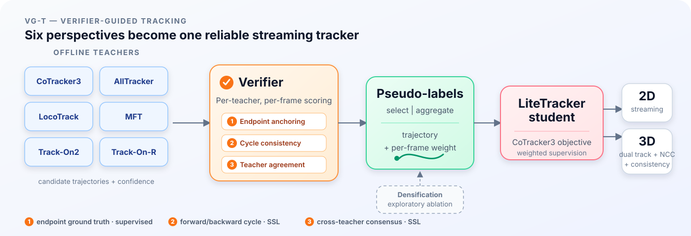
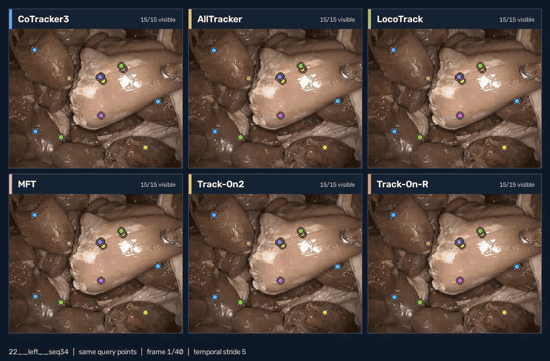

<div align="center">

# VG-T: Verifier-Guided Tracking

### Multi-Teacher Distillation for Streaming Tissue Tracking

Danush Kumar Venkatesh · Peng Liu · Stefanie Speidel<br/>
*National Center for Tumor Diseases (NCT) Dresden*

[](LICENSE)
[](NOTICE.md)
[](requirements.txt)

</div>

VG-T converts sparse endpoint annotations into dense supervision for streaming
tissue tracking. Six point trackers propose trajectories; a verifier scores
them using endpoint anchoring, forward/backward cycle consistency, and
cross-teacher agreement. The scored candidates are fused into weighted
pseudo-labels and used to fine-tune one LiteTracker student.

The repository is developed from
[CoTracker3](https://github.com/facebookresearch/co-tracker). The student uses
its online architecture and sequence loss, while
[LiteTracker](https://arxiv.org/abs/2504.09904) provides the causal streaming
runtime. Our contribution is the STIR data pipeline, multi-teacher verification
and fusion, confidence-weighted fine-tuning, and reproducible evaluation. No
CoTracker3 source is vendored here.

<p align="center">
  
</p>

## Six teachers, one verifier

The panels below show all six teachers on the same clip with identical query
points. Their separating trajectories make agreement, drift, and failure modes
directly visible—the signals used by the verifier when producing supervision.

<p align="center">
  
</p>


The animations are reproducible. See [assets/README.md](assets/README.md) for
the rendering commands.

## Results on the STIR 2025 benchmark

We evaluate VG-T on the STIR 2025 test collection: 234 annotated
2D endpoint tracks and 227 annotated 3D endpoint tracks. The tables place our
locally reproduced result alongside the published 2025 challenge results using
the same threshold-averaged metrics.

### 3D tracking: highest score against the 2025 methods

| Method | 2 mm | 4 mm | 8 mm | 16 mm | 32 mm | Average ↑ |
|---|---:|---:|---:|---:|---:|---:|
| 🥇 **VG-T (ours)** | **33.92** | **58.59** | **75.33** | **88.11** | **95.59** | **70.31** |
| NCT TSO | 33.04 | 51.54 | 75.33 | 87.67 | 94.71 | 68.46 |
| RAFT Stereo | 17.95 | 40.60 | 60.26 | 82.48 | 92.74 | 58.80 |
| CONTROL | 19.82 | 40.53 | 59.91 | 79.30 | 93.83 | 58.68 |
| MFTIQProb | 18.38 | 38.03 | 57.26 | 78.63 | 93.16 | 57.09 |

At **70.31%**, VG-T places first in the 3D tracking accuracy. This is the inference-time result:
right-view queries are recovered from the images and repaired with the geometric
consistency check. We do not use the higher annotation-assisted score here.

### 2D tracking: competitive with the leading submissions

| Method | 4 px | 8 px | 16 px | 32 px | 64 px | Average ↑ |
|---|---:|---:|---:|---:|---:|---:|
| CCG DGIST | 47.01 | 74.79 | 94.87 | 98.72 | 99.57 | 82.99 |
| MFTIQProb | 45.73 | 74.36 | 95.73 | 99.15 | 99.57 | 82.91 |
| MoriLabNU | 44.87 | 76.50 | 94.87 | 98.29 | 99.15 | 82.74 |
| UII-VRI-2D | 46.15 | 76.50 | 94.87 | 97.44 | 98.29 | 82.65 |
| ★ **VG-T (ours) · Top-5** | **45.73** | **72.65** | **91.45** | **96.58** | **98.72** | **81.03** |
| NCT TSO | 43.59 | 72.65 | 91.88 | 96.15 | 98.72 | 80.60 |

The leading methods are close, so we describe VG-T as competitive rather than claiming a statistically resolved
2D improvement.

### Streaming speed

The fast VG-T configuration uses only one refinement iteration. It ranks second
for runtime while retaining **80.85%** 2D accuracy—slightly above the **80.60%**
reported by NCT TSO.

| Operating point | Runtime rank | Refinement iterations | 2D accuracy | Local p95 latency, RTX A5000 |
|---|---:|---:|---:|---:|
| VG-T fast | 🥈 **2nd** | **1** | **80.85%** | **48.7 ms** |

The speed ranking is reported separately because the published 2025 accuracy
table does not include latency. See the [full checkpoint analysis](docs/results/ranking.md),
the [reproduction ranking](docs/results/ranking_reproduction.md), and
[protocol caveats](docs/CAVEATS.md) for provenance and interpretation.

## Quick start

The released environment used Python 3.12 and CUDA 12.1. Training took about
17 hours on one NVIDIA A100 80 GB.

```bash
git clone <repository-url> vg-t
cd vg-t
uv venv --python 3.12 .venv
source .venv/bin/activate
uv pip install -r requirements.txt --extra-index-url https://download.pytorch.org/whl/cu121
cp .env.example .env
```

Edit `.env` with your dataset, upstream-clone, interpreter, and checkpoint
paths. The shell drivers load it automatically. Two upstream compatibility
patches are included; follow [docs/ENVIRONMENTS.md](docs/ENVIRONMENTS.md) for
the exact clone revisions and setup.

Before a long run, validate the complete local path with the smoke tests:

```bash
bash scripts/preflight.sh
bash scripts/smoke_phase2.sh
bash scripts/smoke_train.sh
bash scripts/smoke_eval.sh <checkpoint-from-smoke_train>
```

These checks cover cached-track fusion, exact pseudo-label regeneration, one
GPU optimizer step, strict checkpoint reload, and one streaming evaluation
clip. They do not launch a full training run.

## Reproduce the released model

The full workflow has four stages:

```bash
# Phase 1: collect one teacher over one collection.
bash scripts/collect_teacher.sh cotracker3 orig

# Phase 2: verify and fuse all collected trajectories.
bash scripts/run_phase2.sh

# Train the LiteTracker student.
bash scripts/train.sh

# Evaluate at refinement iterations 1, 2, and 4.
bash scripts/eval.sh
```

Phase 1 consists of 12 independent jobs: six teachers over STIROrig and
STIR-2024. The released raw STIROrig trajectories can be downloaded instead of
recomputed. Exact commands, expected counts, run times, and reference metrics
are in [docs/REPRODUCE.md](docs/REPRODUCE.md); configuration overrides are
documented in [configs/README.md](configs/README.md).

## Data and released artifacts

Large artifacts live on Hugging Face rather than in Git.

| Artifact | Location | Notes |
|---|---|---|
| Student checkpoint | [`nct-tso/VG-Track`](https://huggingface.co/nct-tso/VG-Track) | `student.pth` |
| Six-teacher STIROrig tracks | [`nct-tso/STIR_pseudo_tracks`](https://huggingface.co/datasets/nct-tso/STIR_pseudo_tracks) | Raw `.npz` trajectories, grouped by teacher |
| STIROrig | [IEEE DataPort](https://dx.doi.org/10.21227/w8g4-g548) | Required for Phase 1 and pseudo-label generation |
| STIR-2024 | [Zenodo](https://zenodo.org/records/14803158) | Included in the released training mixture |

Download the released artifacts with the Hugging Face CLI:

```bash
hf download nct-tso/VG-Track student.pth --local-dir artifacts
hf download nct-tso/STIR_pseudo_tracks --repo-type dataset \
  --local-dir data/STIROrig_tracks
```

The checkpoint checksum, raw-track layout, `.npz` schema, and manifest command
are recorded in [docs/ARTIFACTS.md](docs/ARTIFACTS.md). Dataset roots and clip
identifiers are documented in [docs/DATA.md](docs/DATA.md).

## Repository guide

| Path | Purpose |
|---|---|
| [`src/`](src/) | Teacher adapters, verification and fusion, training, and evaluation |
| [`scripts/`](scripts/) | One shell driver per pipeline stage and smoke test |
| [`configs/`](configs/) | Released, smoke, reproduction, and submission-protocol settings |
| [`patches/`](patches/) | Pinned compatibility patches for upstream projects |
| [`tools/`](tools/) | Repository checks, manifests, and visual rendering |
| [`assets/`](assets/) | Pipeline diagram and reproducible README animations |
| [`docs/`](docs/) | Detailed setup, data, runs, results, artifacts, and caveats |

Useful entry points:

- [Reproduction guide](docs/REPRODUCE.md): end-to-end commands and expected results.
- [Environment setup](docs/ENVIRONMENTS.md): upstream repositories, revisions, and environments.
- [Run ledger](docs/RUNS.md): checkpoints and the commands that produced them.
- [Caveats](docs/CAVEATS.md): protocol and artifact differences to read before quoting results.
- [Artifact guide](docs/ARTIFACTS.md): downloads, checksums, and file formats.

## Important caveats

- The released model was trained on pseduo labels from both the **STIROrig + STIR-2024** datasets.
- Training starts from Meta's stock **CoTracker3-Online** checkpoint. The saved
  run configuration retained an older local filename; see
  [docs/CAVEATS.md](docs/CAVEATS.md) for that provenance correction.
- The inference-time 3D score is **0.7031**. The offline reproduction reaches
  **0.7383** because it can use annotation-derived right-view start points that
  are unavailable at inference time.

See [docs/CAVEATS.md](docs/CAVEATS.md) for the complete scope and evaluation
notes.

## Citation

If this code, checkpoint, or released trajectories are useful, please cite this
repository and the STIR dataset.

```bibtex
@software{venkatesh2026vgt,
  author  = {Venkatesh, Danush Kumar and Liu, Peng and Speidel, Stefanie},
  title   = {Verifier-Guided Multi-Teacher Distillation for Streaming Tissue Tracking},
  year    = {2026},
  note    = {Code and model release}
}

@article{schmidt2024stir,
  author  = {Schmidt, Adam and Mohareri, Omid and DiMaio, Simon P. and Salcudean, Septimiu E.},
  title   = {Surgical Tattoos in Infrared: A Dataset for Quantifying Tissue Tracking and Mapping},
  journal = {IEEE Transactions on Medical Imaging},
  volume  = {43},
  number  = {7},
  pages   = {2634--2645},
  year    = {2024},
  doi     = {10.1109/TMI.2024.3372828}
}
```

Machine-readable citation metadata is available in
[CITATION.cff](CITATION.cff).

## Licence

The code is released under [MIT](LICENSE). The checkpoint is distributed under
**CC BY-NC 4.0**, inherited from CoTracker3/LiteTracker. The datasets retain
their own terms. See [NOTICE.md](NOTICE.md) for dependency licences and artifact
provenance.

## Acknowledgements

We gratefully thank the authors and maintainers of the open research projects
that made this work possible: [CoTracker3](https://github.com/facebookresearch/co-tracker), [LiteTracker](https://arxiv.org/abs/2504.09904), [Track-On, Track-On2, and Track-On-R](https://github.com/gorkaydemir/track_on),
  [AllTracker](https://github.com/aharley/alltracker),
  [LocoTrack](https://github.com/cvlab-kaist/locotrack),
  [MFT](https://github.com/serycjon/MFT), [STIRLoader](https://github.com/athaddius/STIRLoader) and
  [STIRMetrics](https://github.com/athaddius/STIRMetrics).

### Funding

This work is partly supported by the Federal Ministry of Research, Technology
and Space in DAAD project 57616814
([SECAI, School of Embedded Composite AI](https://secai.org/)). This work is
funded by the German Research Foundation (DFG, Deutsche
Forschungsgemeinschaft) as part of the Reinhart Koselleck project — Project ID
560101272.
